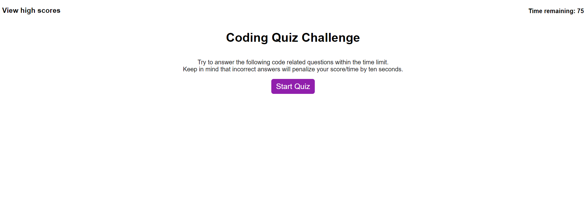

# MerryCodeQuiz

The webpage is a 5-question quiz on basic concepts of javascript. The quiz can be played multiple times, and each time there is a 75-second timer and a total of 50 points to score. Enter the player's initial on the submit page to save the score of each session with the initial. The user can view past scores by clicking the view highscore on the top left hand corner. 

## Preview

## Website Link
https://merryc-jamwhisk.github.io/MerryCodeQuiz/